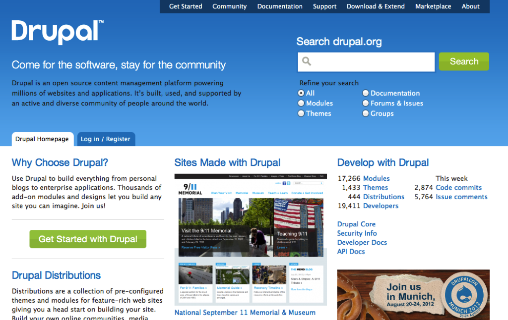
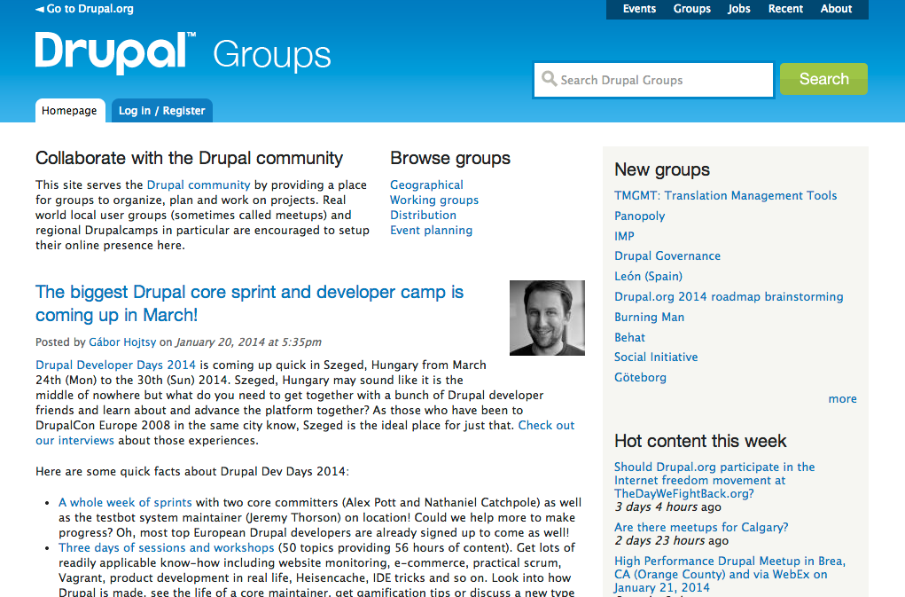
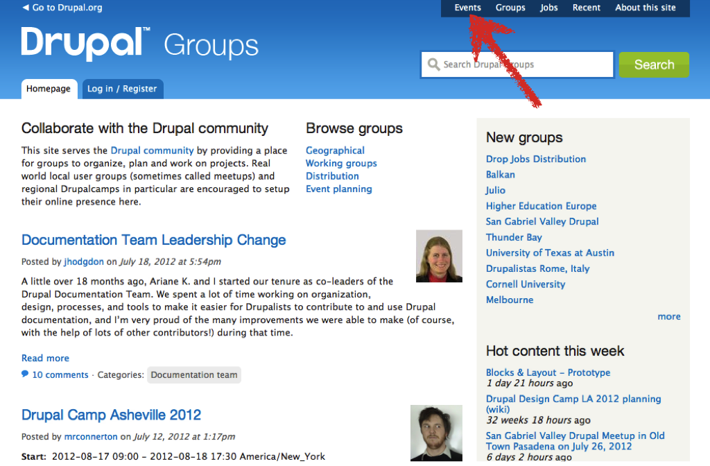
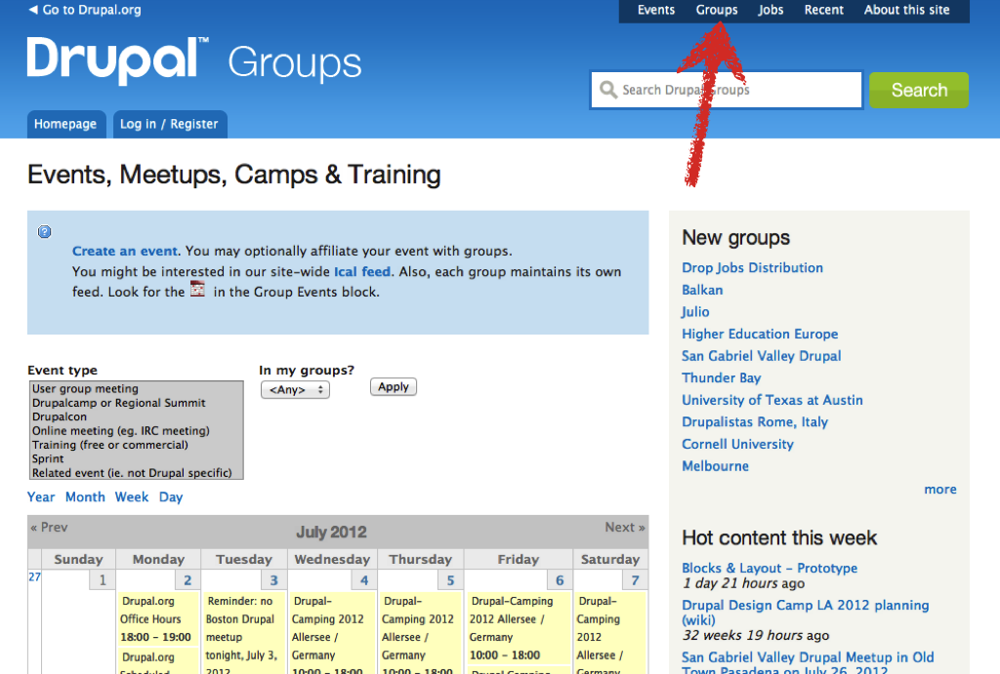
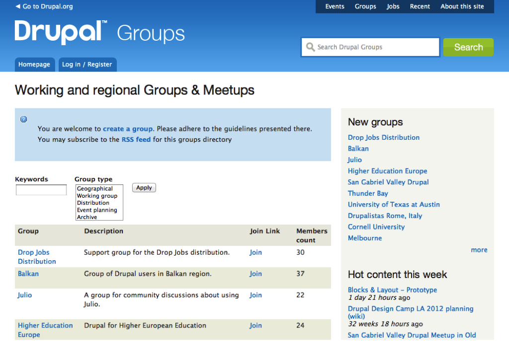
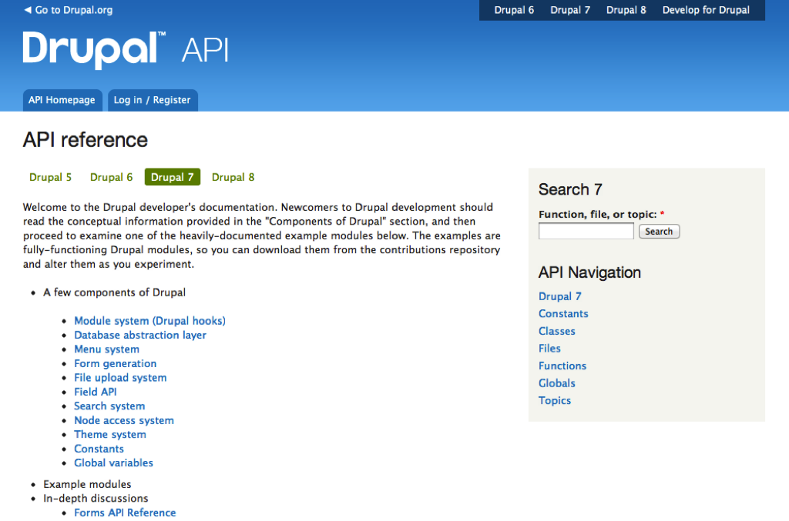
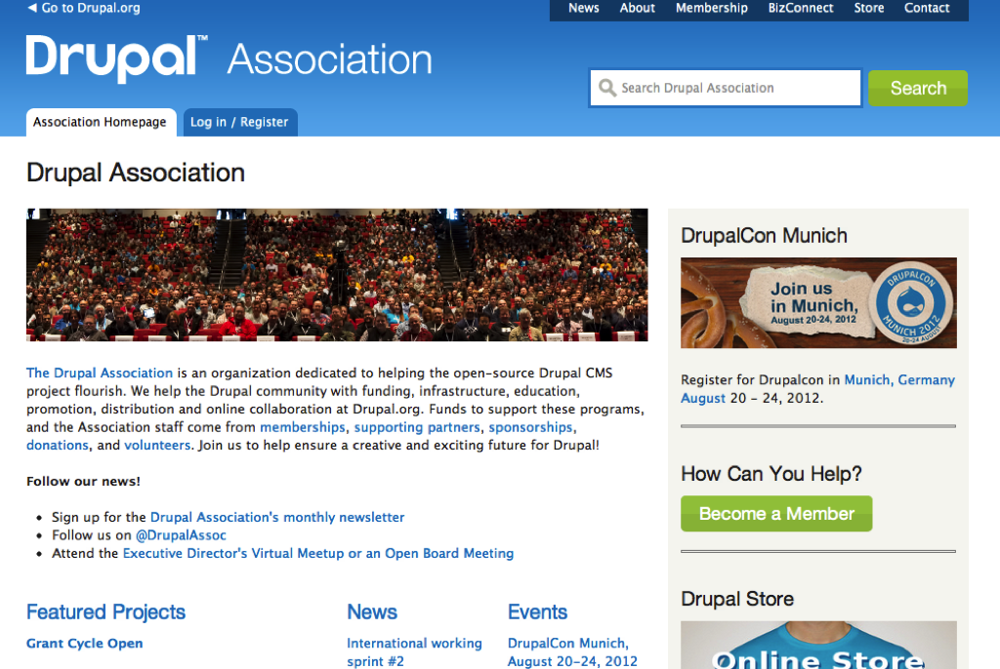
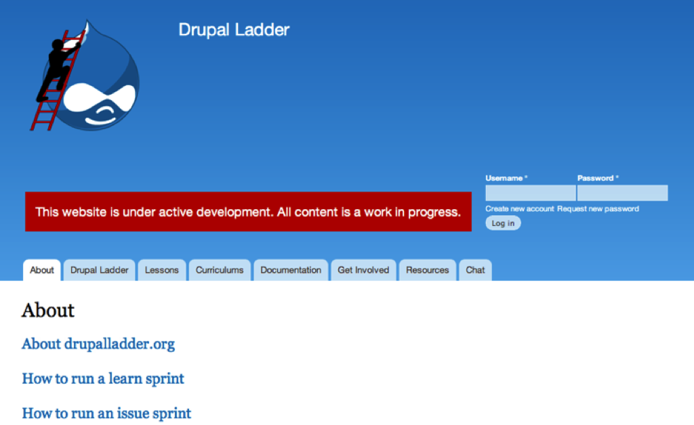
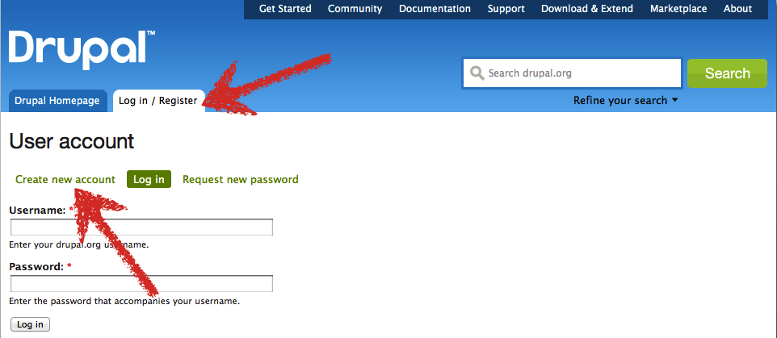

## Drupal Community Tools

Note: These slides go with the Community Tools curriculum which can be found at http://drupalize.me/community-tools

-------
## Why Are We Here?

“It’s really the Drupal community and not so much the software that makes the Drupal project what it is. So fostering the Drupal community is actually more important than just managing the code base.”
- Dries Buytaert

-------
## Our Tools

- Communication tools
    - Community websites
    - Issue queues
    - IRC
- Local development environment
   - AMP stack
   - Git

Note: What OS are people on? What “category” : site builder, dev, themer, designer

====================================

------
## Community Websites

------
## drupal.org 

------
## groups.drupal.org 

Note: Not everyone looks at the tabs at the top. You can find events here.

------
## Searching groups.drupal.org 

Search for events

Note: using the groups tab makes it easier to refine groups search instead of just keyword search

------
## Searching groups.drupal.org 

Search for groups 

Note: using the groups tab makes it easier to refine groups search instead of just keyword search

------
## Working and regional Groups and Meetups 

------
## api.drupal.org 

------
## association.drupal.org 

------
## drupalladder.org 

------
## Drupal.org Account

Also gets you in to:

- groups.drupal.org
- api.drupal.org
- association.drupal.org
- DrupalCon sites

------
## Activity: Create a d.o account

====================================

------
## The Issue Queue

The community todo list

Note: This is all a brief tour of the core issue queue and hands-on creating an issue using the Drupal Ladder lesson

-----
## Dreditor

- Makes the issue queue easier to work with
- Is a browser user script (not a module)
- https://dreditor.org/

======================================

-----
## IRC (`Internet Relay Chat)

Real time communication with other Drupal developers around the world.

-----
## What You Need to Use IRC

- IRC client
- IRC Network to connect to
- Channels to join
- Nickname

-----
## IRC Clients

Web-based clients

- webchat.freenode.net

Application clients

- Pidgin (Adium on Mac) - pidgin.im
- ChatZilla (Firefox extension)

-----
## Network

- Over 650 networks
- Most Open Source projects use the Freenode network
- Address: irc.freenode.net

-----
## Channels

- Freenode has over 10,000 public channels
- The Drupal community has over 100 channels (listed at: drupal.org/irc)
- Drupal channel names all start with #

-----
## Install an IRC Client

Pidgin (http://pidgin.im) is cross-platform, but changes names.

- Mac OS X: Adium
- Windows: Pidgin
- Ubuntu: Pidgin shipped with it
- Other Linux distros: see if there is a package

-----
## Choose a Nickname

- No authentication required to log in.
- Someone might already have the name you want
- Register your nick to preserve it.

Note: Digital identity in IRC isn’t like web sites. You can log in to a system with someone else’s user name. Eventually you will get kicked off if you don’t enter the password for that user name. This is unlike a web site where you can’t log in without a password.

-----
## Join a Channel

Let's start chatting!

- Network: irc.freenode.net
- Channel: #drupal-ladder

Note: Give everyone a few minutes to get logged in and type a "hello" message into the channel.

------
## Notifications

- Ping!
- Use names in conversation to help track.
- Keep conversation in public channels.
- Private Messages (PM) should start with a request in a public channel.

Note: There will be lots of conversations happening at the same time in a channel. Using a person’s name helps to track the conversation. Starting a conversation. Private conversations.

=======================================

-----
## Local Dev Environment

Not just for programmers

-----
## What?

- A Development Environment is a collection of procedures and tools for developing, testing and debugging an application or program.
- LOCAL means you have can do this on your personal computer, not a remote web server.

-----
## Why?

- Working on a live site is dangerous and stupid.
- You can use the tools you like best.
- You don’t mess up other people working.
- You can work with insecure sites/code.
- You can work offline.
- Geek coolness factor.

-----
## How?

You need a web server with PHP:

- Mac: MAMP
- Windows: WAMP
- Linux: packages in your distro

A way to move your work

- (S)FTP
- Version control

-----
## Web Servers

- Mac OS X: MAMP http://mamp.info
- Windows: WAMP http://wampserver.com
- Ubuntu: tasksel and lamp-server
  - sudo apt-get install tasksel
  - sudo tasksel install lamp-server

=========================================

-----
## Version Control and Git

-----
## What?

- A way to keep track of changes
- Many different systems for this:
    - Centralized (CVS, SVN)
    - Distributed (Git, Bazaar, Mercurial)

-----
## Why?

- Backup, backup, backup
- Merging multiple people’s work
- Easily see changes/history
- Easily move/update code in many places

-----
## Why Git?

The Drupal.org community uses it
http://groups.drupal.org/node/48818

=========================================

-----
## What We're Doing

- Install a web server
- Install Git
- Clone and Install Drupal 8 with Git

-----
## Groups

- Do you have AMP, Git, and Drupal 8 installed?
- Do you have AMP and Git installed?
- Do you have AMP installed?

------
## Quick Summary

AMP Stack

- Mac OS X: http://mamp.info
- Windows: http://wampserver.com
- Ubuntu: tasksel and lamp-server

Git 

- http://git-scm.com

Drupal 8

- git clone --branch 8.x http://git.drupal.org/project/drupal.git
